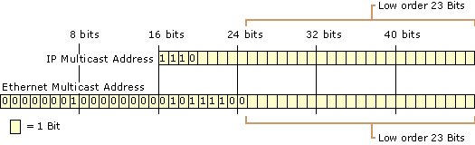

#   DanaAirLink智能设备WiFi配置技术

1.  背景
    *   物联网
    *   智能硬件
    *   WiFi

2.  现有方案
    *   有线网络配置   
        *   设备需要有线网络模块
        *   通过网线接入PC,然后配置WiFi信息
    *   USB或者串口
        *   类似`有线网络配置`,但是通过USB或者串口连接设备
    *   BLE
        *   需要设备和手机支持蓝牙,安装APP就可以设置
    *   AP模式
        *   手机先连接设备AP,然后配置WiFi网络信息
        *   配置过程中需要切换手机WiFi网络
    *   WPS
        *   需要设备和路由器都支持WPS功能
    *   声控
        *   需要设备有MIC,手机APP通过特定频率声音传输WiFi配置信息
        *   对设备MIC和手机扬声器有要求(比如大拿智能声控功能)
    *   扫描二维码
        *   类似`声控`,手机APP生成包含WiFi配置信息的二维码,设备去扫描二维码获取(比如Google Glass)
        *   需要设备有摄像头,而且与镜头聚焦,清晰度,角度,环境光线,手机分辨率等关系很大.
    *   光感应
        *   类似`声控`,手机APP把WiFi信息编码进光信号,然后将屏幕对准设备的感应装置,开始配置.
    *   专有WiFi模块   
        *   TI的SmartLink技术需要CC3000等TI自有模块,协议不对外开放
        *   庆科的EasyLink技术,类似TI,也需要庆科推出的模块
        *   其他类似厂商

3.  Dana利用组播地址传输信息的方法
    *   前置知识
         *   IPv4组播地址和组播Mac地址的映射关系
         *   
         *   WiFi网卡的工作方式
            *   Station
            *   Ap
            *   Monitor
            *   ...
         *  WiFi网卡可以工作在多个信道,比如14个,每次只能在一个信道上工作
         
    *   不难发现IPv4组播地址的最后23位和Mac地址是一样的,Dana利用该特性开发了一套信息传输方法
    *   编码方案
         *   利用23位中的最后16位承载具体信息
         *   利用剩下的7位表示序列号,用于在接收端重新排序和避免信息重复
         *   其中表示seq的7位只使用6位,最高一位表示当前seq是否结束.
         *   由上分析可知,每次可以传输的有效信息为2^6*16=1024bit=128Byte(最多需要2^6个组播地址)
         *   但是可以协调seq和有效信息所占的位数来增加信息承载量,比如利用15位传输8位seq,则每次可以传输的有效信息为2^7*15=1920bit(最多需要2^7个组播地址)
    *   传输流程,定义`发送方A`,`接收方B`,需要传输的信息`中间信息`
         *   `发送方A`将`中间信息`编码进组播地址中
              *   每次取2字节,用于填充组播地址的后16位,组播地址的高9位111000000,生成seq填入中间6位
              *   编码结束时,在seq的最高位置1,可能有效信息最后只剩1字节,此时简单padding1字节的全0
         *   `发送方A`首先连接上WiFi网络
         *   `发送方A`根据编码结果创建相应的组播socket,
         *   `发送方A`同时创建一个特殊的组播socket,最后23位除表示seq结束的位外全为1(用于提高配置速度)
         *   `发送方A`利用每个socket循环发送任意长度任意内容的信息
         *   `接收方B`将WiFi模块设置为`Monitor`模式,在每个信道上监听一段时间(比如500ms),捕获所在空间的所有IEEE802.11数据幀
         *   `接收方B`每捕获一个数据帧解析出源Mac和目的Mac,如果发现是组播地址,则将在该信道上的监听时长延长(比如2s)
         *   `接收方B`如果发现是特殊的组播地址,则将在该信道上的监听时长延长(比如5s)
         *   `接收方B`将捕获到的组播地址按照源Mac进行分组,然后读取每组组播Mac地址的seq位,判断出是否接收到全部组播地址
         *   `接收方B`如果判断出接收到所有组播地址后,参考`编码方案`进行解码,获得`中间信息`
               *    将所有组播地址按照seq进行排序
               *    依次取出每个组播地址的最后2字节
               *    最后获得的信息可能包含1字节的padding

4.  DanaAirLink,基于上述信息传输方法
    *   默认设备都带有WiFi模块
    *   WiFi配置信息定义
 >  
字段名 |长度(byte)|类型| 描述
---|---|---|---
crc32|4|byte|用于判断信息是否损坏
SSID len|1|byte|1th bit represent encrypt_flag; according to the documentation of the standard, the length of an SSID should be a maximum of 32 characters. Some access point/router firmware versions use null-terminated strings and accept only 31 characters.如果是非加密,则任何设备都可以获取信息,如果加密,则只有能正确解密的设备能够获取信息(加解密算法可以判断key是否一致). 
SSID|variable length|byte|Normally ASCII letters and digits, though the standard itself doesn't exclude values.
ENC&IP type|1|byte|highNibble represent enc_type; lowNibble represent ip_type(DHCP or FIXED)
KEY len|1|byte|根据不同的加密类型有不同的限制,但是我们最多支持32位可打印字符
KEY|variable length|byte|
IP|0 or 4|byte|如果是DHCP,则不用,否则需要显式指定
netmask|0 or 4|byte|
gateway|0 or 4|byte|
DNS|0 or 4|byte|

    *   加密方案
        *   可以选择多种对称加密方案(TwoFish/AES...)
        *   可以选择只加密ssid和key,也可以选择全加密(除CRC)
    *   配置流程
        *    `DanaAPP`作为`发送方A`,配有`DanaAirLink`的设备作为`接收方B`,WiFi配置信息的二进制形式作为`中间信息`
        *   安装iOS/AndroidMac OS X/Windows/Linux`DanaAPP`
        *   `DanaAPP`首先会判断手机是否连接WiFi,如果没有连接会提醒用户连接(本方案要求手机接入WiFi网络)
        *   输入WiFi配置信息(`DanaAPP`可以自动获取SSID)
        *   点击开始,`DanaAPP`自动发送配置信息
        *   配有`DanaAirLink`的设备会自动捕获到配置信息,然后连接网络
        *   成功加入WiFi网络的设备发送消息通知`DanaAPP`
        *   `DanaAPP`设备列表出现所有成功配置的设备
    *   优点
        *   纯软件实现,不增加硬件成本
        *   兼容所有WiFi协议版本(802.11b/g/n)
        *   抗干扰,距离远,规避丢包率影响
        *   解析快,成功率高
        *   可选择二种配置方式
            *   一次配置多个设备(方便工厂批量测试/因为是开放的,对接收方没有要求,可能存在安全问题)
            *   单独配置一个设备(利用设备唯一标识码加密,只有该设备能够解密,比如扫描设备二维码)
 
 
 
 
 
 
 ---      
##  总结

*   智能硬件的互联网接入是智能硬件与用户交互的核心体验,`DanaAirLink`实现了简单的交互式网络配置(扫码加密单独配置/或者配置所有设备)
*   已经在MTXXXX/RTLXXXX等常用WiFi模块上测试通过(MT7601需要修改官方驱动)
*   Dana利用组播地址传输信息的方法 
    *   使用领域包括但不限于智能硬件的初次配置
    *   可以基于该方法自定义消息格式,加密方案开发自定义消息传输应用
